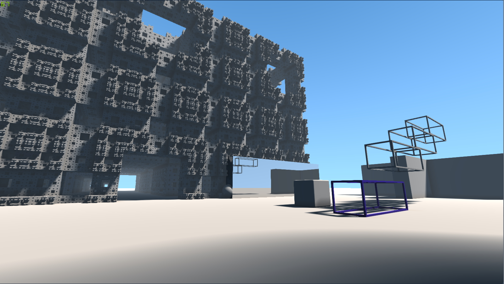
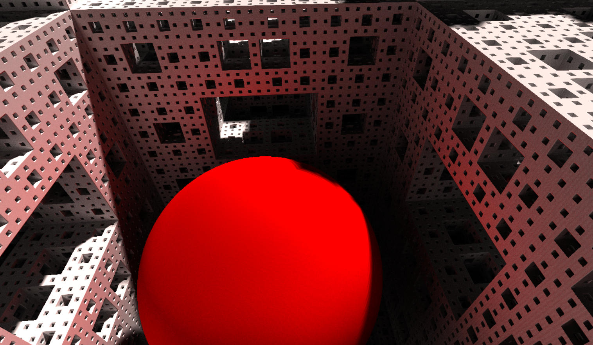

# 3D Java Raymarcher Engine

## Introduction

This project is an Open Source, multi-platform 3D rendering engine based on ray marching technique. This engine aims
to provide a simple rendering using Java.

## Images 

*Simple test scene with primary and shadow ray (realtime)*

*Progressive rendering with global illumination (not realtime)*

## TODO :

- [ ] Use the shapeID to determine the normal
- [ ] Fish-eye effect (barrel distortion)
- [ ] Global illumination
- [ ] Acceleration structure
- [ ] Sphere simulation
- [ ] Sound simulation